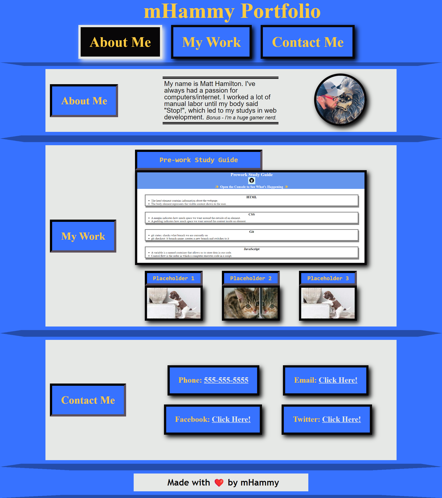
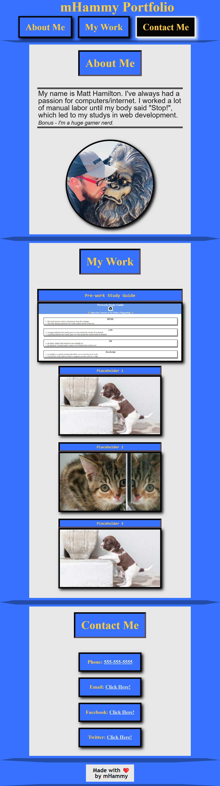

# Show-and-Tell

## Description

- My motivation for this project was creating a portfolio to display my past and future work.
- This application was a ground up project, teaching me new methods of coding along the way.
- I have done my best to keep the entire page accessibility compliant.

## Desktop View

## Tablet View

## Mobile View

## Link to live application

https://mhammy.github.io/show-and-tell/

## Usage

The navigation bar links can be used to jump to relevant sections on the webpage.
When clicking on the work images, you will be directed to the relevant project.

## Credits

The original code was written by me (Matt Hamilton) per the acceptance criteria given to me.

https://learntheweb.courses/topics/html-semantics-cheat-sheet/

https://websitesetup.org/wp-content/uploads/2016/10/wsu-css-cheat-sheet.pdf

https://www.w3schools.com/html/html_favicon.asp

https://developer.mozilla.org/en-US/

## License

Please refer to the License in the repository.
